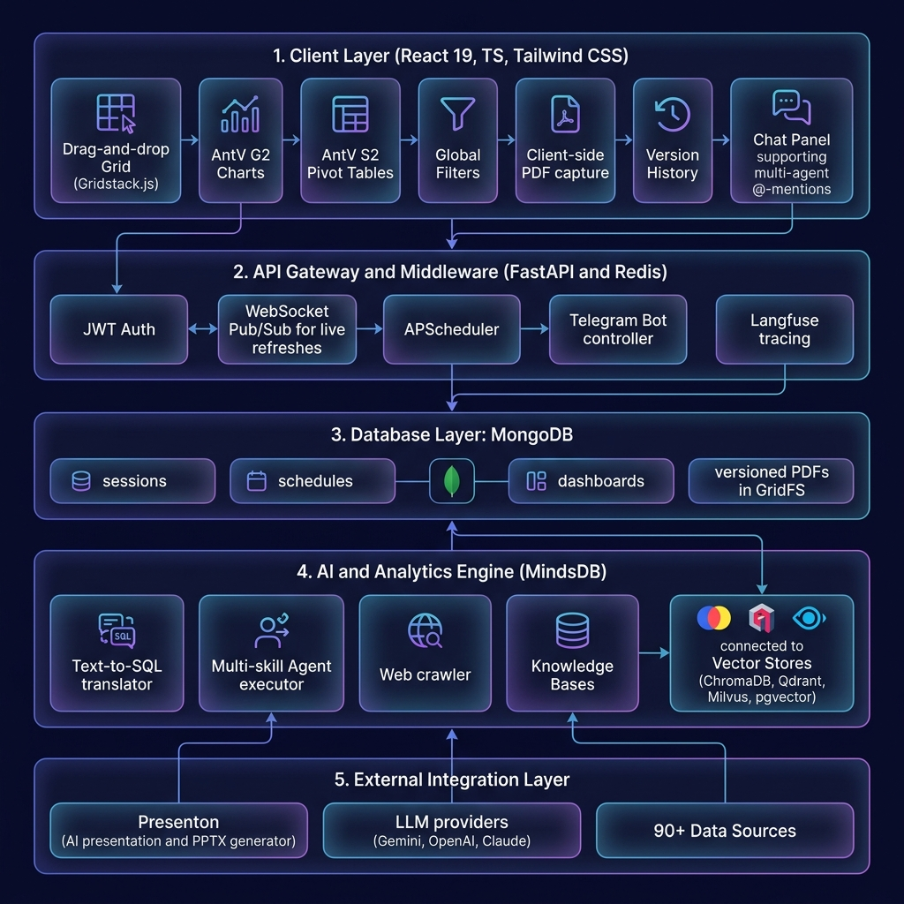
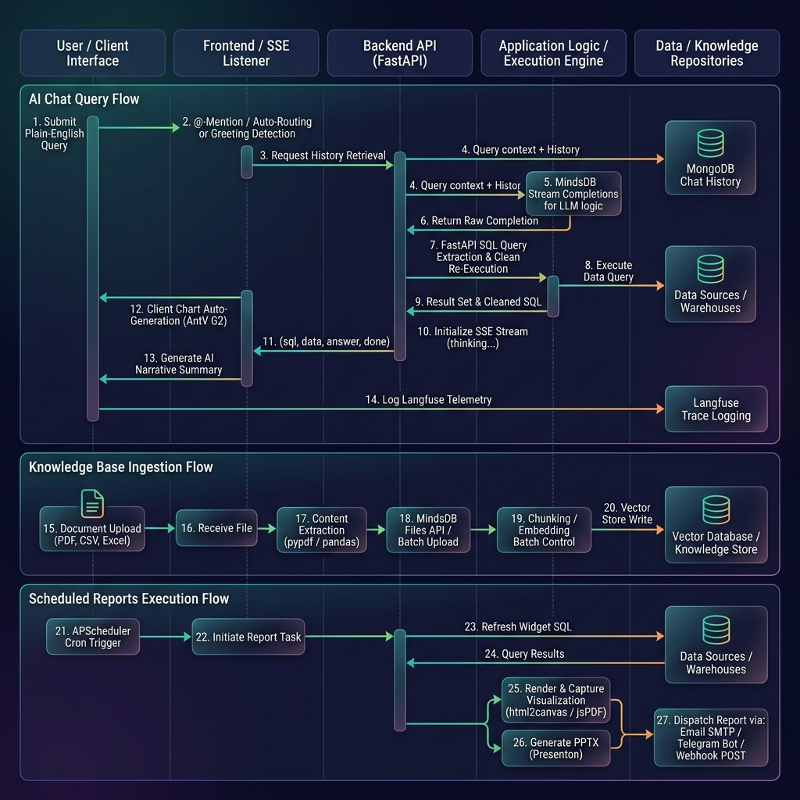

# OpenBI Architectural Reference

This document provides a comprehensive overview of the OpenBI system architecture, components, and data flows. OpenBI is an open-source, self-hosted, AI-native business intelligence platform that translates natural language queries into SQL, renders dynamic charts and pivot tables, routes queries to multiple agents, and manages knowledge bases (RAG) and scheduled reports.

---

## 1. High-Level System Architecture

OpenBI is designed around a decoupled, microservices-oriented architecture orchestrating React, FastAPI, MindsDB, MongoDB, Redis, and custom AI sub-services.

### Architectural Layers & Features

#### A. Client Layer (React 19, TypeScript, Tailwind CSS)
The user interface is a Single Page Application (SPA) designed to provide a premium, real-time analytics experience:
*   **Drag-and-Drop Grid (Gridstack.js 12)**: Allows users to freely resize, position, and reorder dashboard widgets.
*   **Dynamic Visualizations (AntV G2 v5 & S2 v2)**: 
    *   **AntV G2**: Dynamically renders 10+ chart types (bar, line, scatter, radar, area, etc.) using AI-generated configurations.
    *   **AntV S2**: Renders complex pivot tables featuring conditional formatting, sorting, and inline styling.
*   **Global Filters**: Applied instantly across all dashboard widgets (text, dropdown, numeric range, and date range filters).
*   **Version History Drawer**: Displays snapshots of previous dashboard saves, allowing one-click restores.
*   **Client-Side PDF Capture**: Uses `html2canvas` + `jsPDF` to capture dashboards in landscape mode, assigning version numbers and delivering files via Telegram or email.
*   **Smart Chat Panel**: Supports conversational greeting detection, auto-routing, single-agent completions, and multi-agent `@-mentions` queries.

#### B. API Gateway & Middleware (FastAPI & Redis)
The FastAPI server orchestrates requests, schedules tasks, manages real-time updates, and handles user security:
*   **JWT Authentication**: Issue tokens signed with HS256, verify user credentials, and hash passwords using bcrypt.
*   **WebSocket pub/sub (Redis 7)**: Broadcasts real-time events to all active dashboard viewers when changes occur.
*   **APScheduler (AsyncIOScheduler)**: An in-process cron scheduler that manages and runs scheduled reports asynchronously.
*   **Langfuse Telemetry Tracing**: Tracks token usage, latency, cost estimation, and agent reasoning.

#### C. Database Layer (MongoDB)
*   **MongoDB (External)**: Stores application metadata including users, organization branding, connections, dashboards, chat sessions, and cron schedules.
*   **GridFS Versioning**: GridFS stores and versions generated PDFs, supporting the download of historical exports.

#### D. AI & Analytics Engine (MindsDB)
MindsDB handles text-to-SQL translation, vector indexing, and agent execution:
*   **SQL translation**: Converts natural language questions into database-specific SQL queries.
*   **Multi-skill Agents**: Orchestrates agents equipped with SQL execution capabilities, prompt templates, and custom knowledge base search.
*   **Knowledge Bases (RAG)**: Integrates vector databases (ChromaDB, Qdrant, Milvus, pgvector, etc.) for semantic search on uploaded documents (PDFs, CSVs, Excel, JSON, etc.) and crawled websites.

#### E. External Integration Layer
*   **LLM Providers**: Integrates Google Gemini, OpenAI (GPT-4o), and Anthropic Claude for completions and routing.
*   **Presenton Container**: A self-hosted AI generator that takes dashboard summaries and builds editable `.pptx` presentations.
*   **90+ Data Sources**: Includes built-in connectors for databases (PostgreSQL, MySQL, SQLite, MongoDB), data warehouses (Snowflake, BigQuery), and SaaS APIs (Stripe, HubSpot, GitHub).

---

## 2. Low-Level Data Flows

The platform processes multiple concurrent workflows. The diagram below maps the execution lifecycles of chat queries, document ingestions, and cron reporting.

### A. AI Chat Query Flow (The Core Path)
1.  **Routing Check**: The client inspects the query. If a conversational greeting is matched, a local template response is returned instantly. If multiple agents are `@-mentioned` (e.g., `@Sales @Marketing`), the request is sent to a parallel routing endpoint.
2.  **FastAPI Session Fetch**: FastAPI loads the last 20 messages of chat history from MongoDB to compile conversational context.
3.  **MindsDB SSE Stream**: FastAPI invokes the MindsDB agent completions stream. MindsDB uses the LLM to decide on a skill (e.g., executing SQL or searching a Knowledge Base).
4.  **SQL Interception & Clean Query**: FastAPI reads the stream chunk-by-chunk. If an SQL execution statement (e.g. `Executing final SQL query: SELECT...`) is matched via regex, FastAPI intercepts the SQL and directly query-executes it via MindsDB's SQL REST API. This retrieves clean, raw JSON rows and columns.
5.  **SSE Event Delivery**: FastAPI streams events back to the client browser: `thinking` (reasoning steps), `sql` (the database query), `data` (JSON rows), `answer` (LLM-synthesized narrative), and `done` (completed metadata).
6.  **Client-Side Finalization**: The browser's `useChat` hook renders the stream, calls the Chart Agent to generate an AntV G2 configuration, requests a Narrative Agent summary, saves the message documents in MongoDB, and logs telemetry metrics (latency, token counts, cost estimate) to the analytics collection.

### B. Knowledge Base RAG Flow (Document Ingestion)
1.  **File Upload**: The user uploads a file (PDF, CSV, Excel, JSON, Parquet, or Markdown) in the UI.
2.  **FastAPI Extraction**: The backend extracts raw text using specialized parsers (e.g., `pypdf` for PDFs, `pandas` for tabular data, or UTF-8 decoding).
3.  **MindsDB File API**: FastAPI uploads the processed text to MindsDB. MindsDB chunks, embeds, and indexes the text.
4.  **Vector Storage**: The embeddings are stored in the chosen vector database (such as the default built-in ChromaDB, or external stores like Qdrant or Milvus).
5.  **RAG Search**: When an agent executes a query involving this Knowledge Base, MindsDB performs semantic retrieval and combines the retrieved document chunks with live database SQL query results.

### C. Scheduled Reports Execution Flow
1.  **APScheduler Trigger**: The cron scheduler fires at the configured interval.
2.  **Data Refresh**: The backend fetches the latest dashboard widget configurations and re-runs their SQL queries against MindsDB to refresh the cached data.
3.  **Visual Capture**:
    *   **PDF Report**: The runner uses client-side rendering hooks to capture the dashboard grid via `html2canvas` and compile it into a PDF using `jsPDF`.
    *   **PPTX Presentation**: The runner compiles dashboard metrics, sends them to the **Presenton** container, and receives a generated `.pptx` presentation.
4.  **Multi-channel Delivery**:
    *   **Email**: Sends an HTML report with the PDF attached via an async SMTP service (aiosmtplib) using STARTTLS on port 587.
    *   **Telegram**: Dispatches a PDF document to the registered Telegram Chat ID using the python-telegram-bot wrapper.
    *   **Webhook**: Posts a HTTP JSON payload with widget details to the designated webhook URL.
5.  **Persistence**: Records the job execution status, timestamp, and result logs in the schedules history collection.
